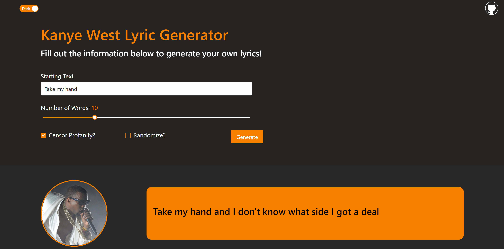

# Kanye Lyric Generator

In this project, I attempt to use Recurrent Neural Networks in `Pytorch` for text generation. Specifically, I take a sample of [Kanye West](https://en.wikipedia.org/wiki/Kanye_West) verses to generate new lyrics! Afterwards, the model was deployed to `Flask` via [Heroku](https://www.heroku.com/about) and connected to a simple `React App`

**Note: The website can be viewed [here](https://kanye-lyric-generator.herokuapp.com/)**



<br />
<br />

## Getting Started

To get this project running on your machine, follow the instructions below

### Jupyter Notebook

To make changes to the Jupyter Notebook, you will need to install [Pytorch](https://pytorch.org). You can find more in-depth instructions on how to do so [here](https://deeplizard.com/learn/video/UWlFM0R_x6I)

Alternatively, you can simply view the results of the Jupyter Notebook [here](https://jovian.ai/nishantbalepur/kanye-lyric-generator) on Jovian, or [here](./Kanye%20Lyric%20Generator.ipynb) in the repository locally

### Flask Web App

Before you are able to run the web server, you will need to install `Python` and `Flask`. Instructions on how to set up `Flask` with `Visual Studio Code` can be found [here](https://code.visualstudio.com/docs/python/tutorial-flask)

Now, run the following command to get the files on your machine

```
git clone https://github.com/nbalepur/Kanye-Song-Generator.git
```

Navigate to `./Kanye-Song-Generator/`, and run the following command:

```
flask run
```

This will open up the website in locally in your default browser

<br />
<br />

## Website User Guide

Navigating the website is very simple! To start generating lyrics, you must first fill out the following fields:

- **Starting Text**: The beginning of the lyric to be generated
- **Number of Words**: The number of additional words to generate
- **Censor Profanity?**: Checkbox to hide/show explicit language
- **Randomize?**: Designates whether the algorithm should select the best fitting word, or a random word from the top 3

After these fields are tuned to your liking, simply press **Generate** to create the new lyric!

<br />

This website also has a light / dark mode switch in the upper-left hand corner!


